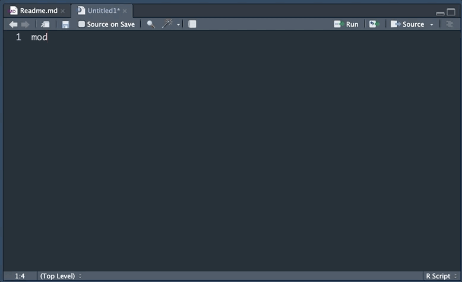
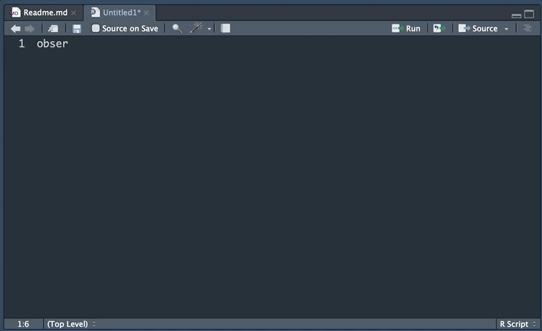
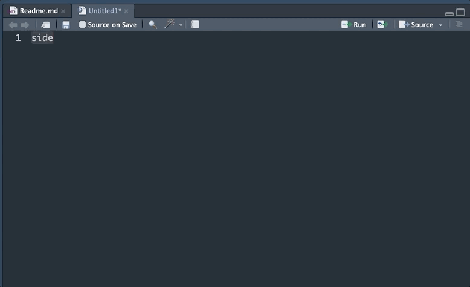

<!-- README.md is generated from README.Rmd. Please edit that file -->

```{r setup, include = FALSE}
knitr::opts_chunk$set(
  collapse = TRUE,
  comment = "#>",
  fig.path = "man/figures/README-",
  out.width = "100%"
)
# Copy reference/images to man/images
# reference folder is required to work with pkgdown
if (!dir.exists("man")) {dir.create("man")}
if (!dir.exists("man/figures")) {dir.create("man/figures")}
file.copy(list.files("reference/figures", full.names = TRUE),
          "man/figures", overwrite = TRUE)
# if (dir.exists("docs")) {
#   file.copy("reference/figures/thinkr-hex-remedy-favicon.ico",
#             "docs/favicon.ico", overwrite = TRUE)
# }
```

<!-- badges: start -->
[](https://github.com/ThinkR-open/shinysnippets/actions)
<!-- badges: end -->

# shinysnippets 

The goal of shinysnippets is to save development time while taking advantage of Rstudio snippets for Shiny applications.

## Installation of snippets

### Via the package

You can install the dev of {shinysnippets} from GitHub:

``` r
remotes::install_github("Thinkr-open/shinysnippets")
```

Then run: 

``` r 
shinysnippets::add_snippets()
```

You'll be asked to validate the writing of the snippets in `~/.R/snippets/r.snippets`. 

Restart RStudio to make these snippets effective.

### Manually

Copy and paste these snippets to Tools > Global Options > Code > Editing > Edit Snippets.

## Snippets list 

### Modules

```{}
snippet module
	${1:name}ui <- function(id){
		ns <- NS(id)
		tagList(
		
			)
		}

	${1:name} <- function(input, output, session){
		ns <- session\$ns
	}
	
	# Copy in UI
	${1:name}ui("${1:name}ui")
	
	# Copy in server
	callModule(${1:name}, "${1:name}ui")
```



### observeEvent 

```{}
snippet observe_event
	observeEvent( ${1:event} , {
	
	})
```



### sidebar_page

```{}
snippet sidebar_page
	library(shiny)
	
	ui <- fluidPage(
	  titlePanel( "${1:title}" ), 
	  
	  sidebarLayout(
	    sidebarPanel(
	    
	    ),
	    mainPanel(
	    
	    )
	  )
	)
	
	server <- function(input, output, session) {
	  
	}
	
	shinyApp(ui, server)
```



### withProgress

```{}
snippet with_progress
	withProgress( message = "${1:message}" , {
	
	})
```


Please note that the 'shinysnippets' project is released with a [Contributor Code of Conduct](CODE_OF_CONDUCT.md). By contributing to this project, you agree to abide by its terms.

