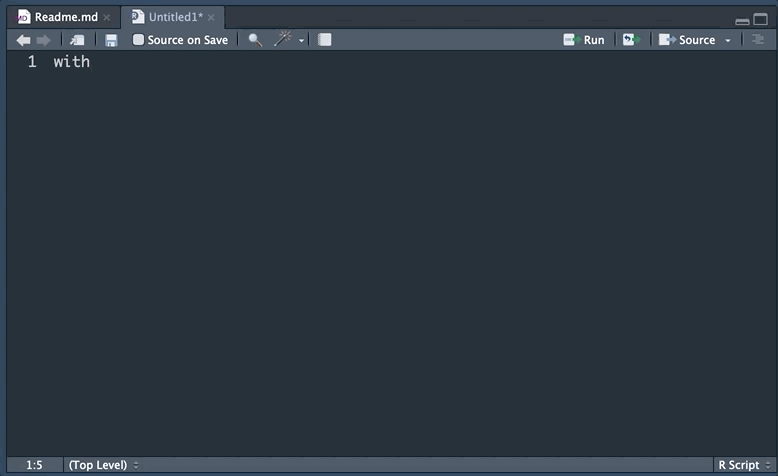

# A series of shiny related RStudio Snippets 

## How to install 

Copy and paste these snippets to Tools > Global Options > Code > Editing > Edit Snippets

## Modules

```
snippet module
	${1:name}ui <- function(id){
		ns <- NS(id)
		tagList(
		
			)
		}

	${1:name} <- function(input, output, session){
		ns <- session\$ns
	}
	
	# Copy in UI
	${1:name}ui("${1:name}ui")
	
	# Copy in server
	callModule(${1:name}, "${1:name}ui")
```


## observeEvent 

```
snippet observe_event
	observeEvent( ${1:event} , {
	
	})
```


## withProgress

```
snippet with_progress
	withProgress( message = "${1:message}" , {
	
	})
```

